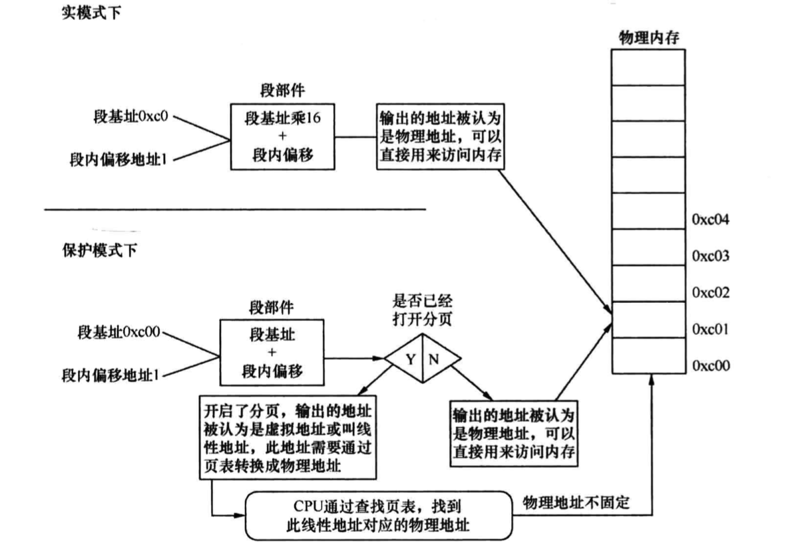

## 分段
内存是随机读写的，即访问其中任何一处都不需要从头开始找，直接访问给定的一个地址即可。如访问0xC00,只需要将此地址写入的地址总线即可
那为什么要分段呢？
因为贫穷限制了想象力，以前的cpu和寄存器都设计成16位，并不像现在的64位的cpu和寄存器。那2的10次方是1K，20次方是1M，16次方是64KB
那么大于64K的地址将无法访问，还有一个更重要原因是当时没有虚拟地址，那么不同的程序如果使用相同的地址将无法运行，
所以就有了"段基址+段内便偏移"的方式访问了，达到重定向的目的。
段基址保存在段基址寄存器（cs、ds、es）里面，如果程序需要访问某个地址就通过段基址+偏移量就可以了，那访问64K的限制怎么解决的呢？
单纯的相加只能到128k，如果是1M（16个64K）的内存咋办？通过基地址左移四位，这样的基地址就相当于*16了，这样基地址就是20位了，再
加上段内偏移就可以在1M的空间内随意访问了。

## 物理地址、线性地址
物理地址就是物理内存正真的地址，在实模式下上面的"段基址+段内便偏移"就是真实的物理地址，而在保护模式下，称为线性地址，不过此时的段基址
已经不再是真正的地址了，而是一个索引，通过索引可以在GDT中找到相应的段描述符，改描述符中记录了该段的起始、大小等信息，这样便得到了段
基址。如果此时未开启分页，这个线性地址就被当做物理地址，如果开启，就叫做虚拟地址（虚拟地址和线性地址在分页机制下是一样的），虚拟地址需要
经过CPU转化成物理地址。
无论是实模式还是保护模式，段内偏移地址叫做逻辑地址，这是程序员可见的地址。最终地址还是由段基址+段内偏移地址组合而成。段基址要么是在
实模式下默认的段寄存器中，要么在保护模式下选择子寄存器指向的段描述符中，所以只要给一个段内偏移地址就可以了。

还有最后一个问题需要解释，就是虚拟地址怎么转化为物理地址的。是通过MMU(CPU中的内存管理单元)转换成物理地址。

Linux内核中采用了一种同时适用于32位和64位系统的内存分页模型，对于32位系统来说，两级页表足够用了，而在x86_64系统中，用到了四级页表。四级页表分别为：
页全局目录(Page Global Directory)
页上级目录(Page Upper Directory)
页中间目录(Page Middle Directory)
页表(Page Table)