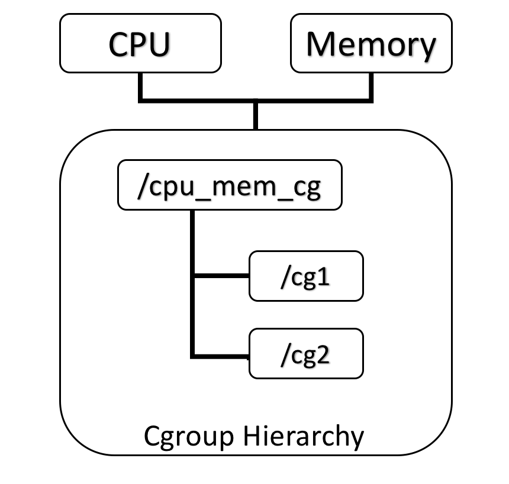

资源限制（Resource Limitation）：cgroups可以对进程组使用的资源总额进行限制。如设定应用运行时使用内存的上限，一旦超过这个配额就发出OOM（Out of Memory）。
优先级分配（Prioritization）：通过分配的CPU时间片数量及硬盘IO带宽大小，实际上就相当于控制了进程运行的优先级。
资源统计（Accounting）： cgroups可以统计系统的资源使用量，如CPU使用时长、内存用量等等，这个功能非常适用于计费。
进程控制（Control）：cgroups可以对进程组执行挂起、恢复等操作。


task（任务）：cgroups的术语中，task就表示系统的一个进程。
cgroup（控制组）：cgroups 中的资源控制都以cgroup为单位实现。cgroup表示按某种资源控制标准划分而成的任务组，包含一个或多个子系统。一个任务可以加入某个cgroup，也可以从某个cgroup迁移到另外一个cgroup。
subsystem（子系统）：cgroups中的subsystem就是一个资源调度控制器（Resource Controller）。比如CPU子系统可以控制CPU时间分配，内存子系统可以限制cgroup内存使用量。
hierarchy（层级树）：hierarchy由一系列cgroup以一个树状结构排列而成，每个hierarchy通过绑定对应的subsystem进行资源调度。hierarchy中的cgroup节点可以包含零或多个子节点，子节点继承父节点的属性。整个系统可以有多个hierarchy。


同一个hierarchy可以附加一个或多个subsystem。如下图1，cpu和memory的subsystem附加到了一个hierarchy。




```go
apt-get install cgroup-bin

查看所以的cgroup
lscgroup
cpuset:/
cpu:/
cpuacct:/
memory:/
devices:/
freezer:/
blkio:/
perf_event:/
hugetlb:/

```
查看所以支持的子系统
```go
lssubsys -a
cpuset
cpu
cpuacct
memory
devices
freezer
blkio
perf_event
hugetlb

```

查看所有子系统挂载的位置  lssubsys –m

查看单个子系统（如memory）挂载位置：lssubsys –m memory